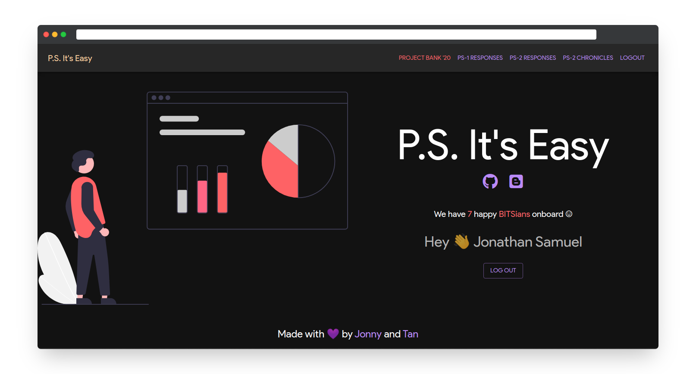
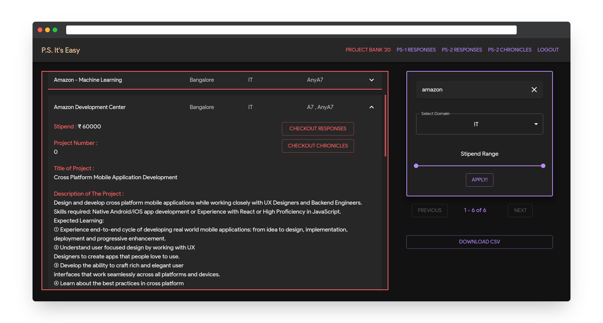
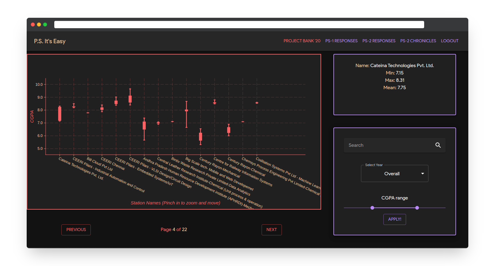
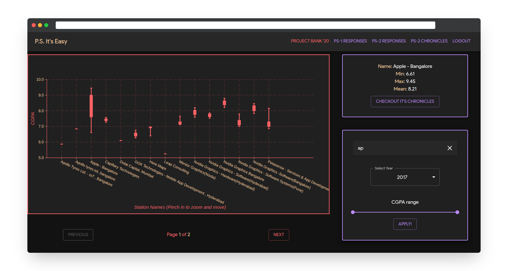
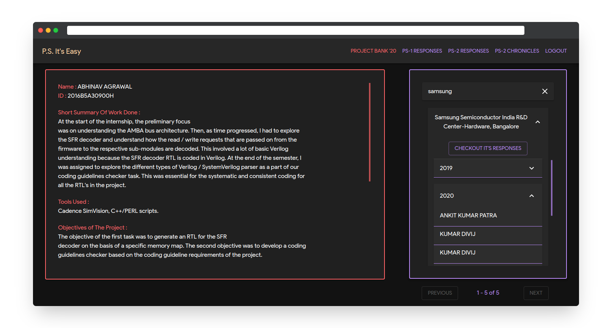

    
      
    <h1><code>P.S. It's Easy</code></h1>

<h2>All-in-one Web App for all your Practice School Allotment needs!</h2>

<!--  -->
<!--  -->

# About

A Web Application to display, browse and filter Practice School Stations and it's Chronicles over the past year with CG cutoff analytics in a easy to use web interface. There is also access to the latest Project Bank and the provision to download CSV to rearrange and update your preferences at PSD website with the [PS Companion](https://github.com/Joe2k/PS-Companion) Extension!

# How to use?

-   Go to the website [psitseasy.ml](https://psitseasy.ml/), and log in with BITS mail ID only. _(We had to use Google log in as we letting Allotment details of students on the open internet dint seem like the best idea, so its only to identify user as a BITSian, we don't take any other information)_
-   After Logging in you would be able to see different tabs in the Nav Bar. You can click and explore each on of them! For more details in each page checkout the **Features** section below.

# Features and Screenshots

-   ## Home Page (Login with BITS mail only)

    

-   ## Project Bank
    Here you will be able to view and the **PS-2 Sem 1** Stations and their Projects

-   See last 4 years CGPA trends for all stations in a intuitive boxplot graph, with search and CGPA fiters.
    (The source of the data used was the crowd sourced information collected after PS2 allotment from 2017 to 2020)

-   Browse chronicles of last 4 years (2017-2020) with a few clicks and know first-hand accounts of people's experiences .
    (SOURCE:official PS chronicles )
-   coming soon - download the latest Project bank from a few clicks into an CSV form. (CSV compatible with PS companion extension)

# Screenshots

# Disclaimer

-   The data used in the box plots were crowdsourced from the previous year's google forms responses and thus it doesn't account for every student's entry.
-   Aggregation of Station names and connection between the chronicles and responses is done using fuzzy techniques, so please be aware of the names.
-   Since the PS forms before this year had field where students had to fill the station names, the names varied so much with each entry and we spent a lot of time to clean automatically and manually. However the names in chronicles page and responses page might be different a bit. So sometimes fuzzy might not pick it up. So we recommend you search all the possible combinations of the station name like full form/ short form etc. This most probably won't be a problem cause we took enough care. But still its a disclaimer.

# Contribute

-   We do need volunteers to help maintain this project over the years,
    as it needs data to be fed in every 6 months as the new PS cycle commences,
    thus we welcome contributors that can help in the same.
-   If this project helped you or your friends please consider contributing.
-   If you have ideas for new features or any feedback, feel free to let us know.

# For Project Contributors

Start Server

`docker run --rm -d --name ps-its-easy --network <some-network> -v <absolute-path-to-this-repo>:/root rust:alpine /bin/sh ~/entrypoint.sh`  
_Note: Alternatively, you can expose the port instead of using --network, if you don't have a reverse proxy_

For enabling ssh access to the container:

1. Change the public key in .ssh/authorized_keys, you can generate new ones by using `ssh-keygen -f filename -t ecdsa` on any linux system
2. If you don't have a reverse proxy, you should expose and map the port 22 of the container to the host using `-p ` in the `docker run` command
3. ssh using `ssh <path-to-private-key> root@<host-path> -p <port-mapped-in-host>`
4. You have nano and git there for small file changes. Please only use `./restart.sh` in the home directory to restart the server
   _Note: If you are a new contributor to the official site at psitseasy.ml, please get the ssh keys from another maintainer_

**Made with <3 by Tan and Jonny**
