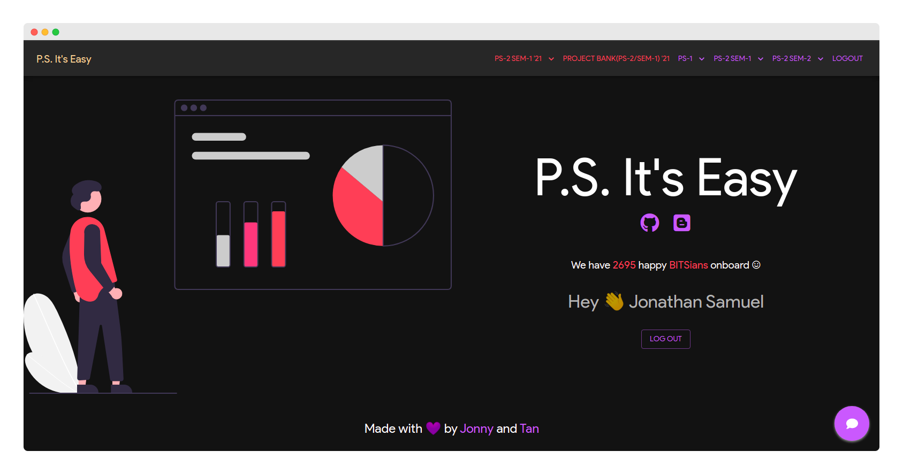

    
      
    <h1><code>P.S. It's Easy</code></h1>

<h2>All-in-one Web App for all your Practice School Allotment needs!</h2>

# About

A Web Application to display, browse and filter Practice School Stations and it's Chronicles over the past year with CG cutoff analytics in a easy to use web interface. There is also access to the latest Project Bank and the provision to download CSV to rearrange and update your preferences at PSD website with the [PS Companion](https://github.com/Joe2k/PS-Companion) Extension!

Checkout our blog [here](https://one-to-tan.blogspot.com/2021/05/ps-its-easy.html) to know about all the features, tech stack and the story behind this! :)

# How to use?

-   Go to the website [psitseasy.ml](https://psitseasy.ml/), and log in with BITS mail ID only. _(We had to use Google log in as we letting Allotment details of students on the open internet dint seem like the best idea, so its only to identify user as a BITSian, we don't take any other information)_
-   After Logging in you would be able to see different tabs in the Nav Bar. You can click and explore each on of them! For more details in each page checkout the **Features** section below.

# Features and Screenshots

-   ## Home Page

    -   Login with BITS mail only
        

-   ## Project Bank (Currently has latest PS2 Sem 1 2021 Details)

    -   Here you will be able to view and the **PS-2 Sem 1 2021** Stations and their Projects. This will be updated at each PS cycle to the one thats currently going on. We currently have PS2 Sem 1 2021 Station Details which is being updated regularly.
    -   You can apply filters like domain, stipend, branch and also search the name and location of the Station.
    -   In each Station you can see all its details when you click on the dropdown.
    -   You also get 2 buttons to checkout the previous year's chronicles and responses of the same station if available.
    -   There is also a **Download CSV** button with which you can download all the Station Details. Then you can rearrange these stations by moving the rows according to your preferences and then you can upload it in the PSD website with the [PS Companion](https://github.com/Joe2k/PS-Companion) Chrome Extension which is also built and maintained by us. So we will make sure both of these are compatible with each other all the time!
        

-   ## Responses Page (_For PS1 and PS2_)

    -   Here you can see the latest stats from the last 4 years **PS** Responses.
    -   You can use filters for year, cgpa and search for station names.
    -   You can zoom and move inside the box plot.
    -   When you hover over a station the details will come up on the right.
    -   You will also get a _Checkout it's chronicles_ button which will take you to the chronicles of that specific station if available.
        

-   ## Chronicles Page (_For PS1 and PS2_)

    -   Here you can see the chronicles of the past 4 years **PS** Stations.
    -   You can search for stations and view the different years drop downs and each dropdown be able to see the name of the student in the PS station.
    -   Once you click on the name you can see the whole chronicle on the left.
    -   There is also a _Checkout it's responses_ button which takes you to the responses page of that specific station.
        

-   ## Chatbot

    -   This chatbot is for quick and easy searching of station details and cutoff or even the mess menu :P.
    -   Eg. 'Can I get the cgpa cutoff for Flipkart?'
    -   This was built with [rasa](https://rasa.com/) and the code is available in the same repo

        

        
        

# Disclaimer

-   The data used in the box plots were crowdsourced from the previous year's google forms responses and thus it doesn't account for every student's entry.
-   Aggregation of Station names and connection between the chronicles and responses is done using fuzzy techniques, so please be aware of the names.
-   Since the PS forms before this year had field where students had to fill the station names, the names varied so much with each entry and we spent a lot of time to clean automatically and manually. However the names in chronicles page and responses page might be different a bit. So sometimes fuzzy might not pick it up. So we recommend you search all the possible combinations of the station name like full form/ short form etc. This most probably won't be a problem cause we took enough care. But still its a disclaimer.

# Contribute

-   We do need volunteers to help maintain this project over the years,
    as it needs data to be fed in every 6 months as the new PS cycle commences,
    thus we welcome contributors that can help in the same.
-   If this project helped you or your friends please consider contributing.
-   If you have ideas for new features or any feedback, feel free to let us know.

# For Project Contributors

Start Server

`docker run --rm -d --name ps-its-easy --network <some-network> -v <absolute-path-to-this-repo>:/root rust:alpine /bin/sh ~/entrypoint.sh`  
_Note: Alternatively, you can expose the port instead of using --network, if you don't have a reverse proxy_

For enabling ssh access to the container:

1. Change the public key in .ssh/authorized_keys, you can generate new ones by using `ssh-keygen -f filename -t ecdsa` on any linux system
2. If you don't have a reverse proxy, you should expose and map the port 22 of the container to the host using `-p ` in the `docker run` command
3. ssh using `ssh <path-to-private-key> root@<host-path> -p <port-mapped-in-host>`
4. You have nano and git there for small file changes. Please only use `./restart.sh` in the home directory to restart the server
   _Note: If you are a new contributor to the official site at psitseasy.ml, please get the ssh keys from another maintainer_

**Made with <3 by Tan and Jonny**
